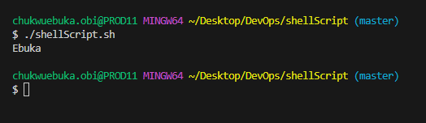
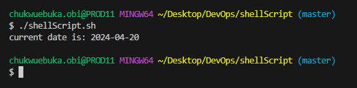
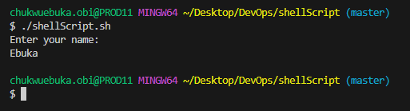
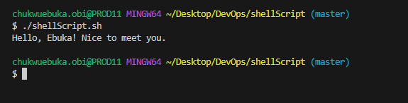
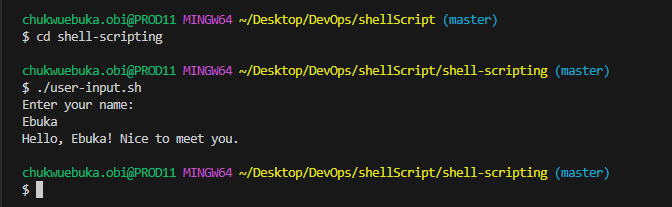
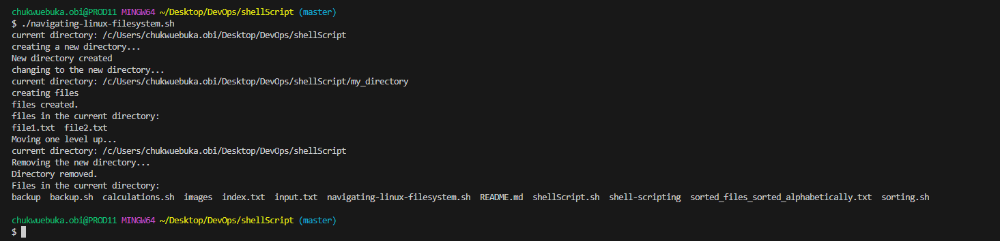
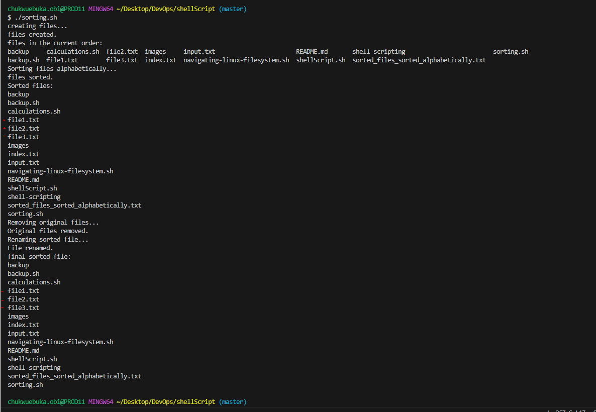
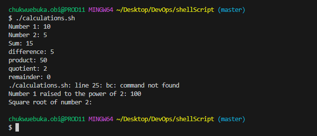

## INTRODUCTION TO SHELL SCRIPTING

In this course we will be going over some shell scripting syntax

1. Variables: Variables like every programming language are assigned to a value.

```
name="Ebuka"
echo $name
```



2. Control Flow: We can use the if, if else, for and while loops statement to control the flow of
   execution in our script.

- if and if else statement

```
read -p "Enter a number: " num

if [ $num -gt 0 ]; then
    echo "The number is positive."
elif [ $num -lt 0 ]; then
    echo "The number is negative."
else
    echo "The number is zero."
fi
```


- For loop

```
for (( i=1; i<=5; i++ ))
do
    echo $i
done
```


3. Command substitution Captures output of a command and use it as a value within our script

```
current_date=$(date +%Y-%m-%d)
echo "current date is: $current_date"
```



4. Input and output: There are various ways to input and output data in a bash script. We can also
   redirect scripts into a file > (output to a file) or, < (input from a file) and | (pipe the
   output of one command as input to another).

- Accept user input

```
echo "Enter your name:"
read name
```



- Output of the result of a command into a file. The file will be auto created.

```
echo "hello world" > index.txt
```


- Pass the content of a file as input to a command

```
grep "pattern" < input.txt
```


5. Functions We can also run functions in bash scripts. Functions are reusable.

```
greet() {
    echo "Hello, $1! Nice to meet you."
}

call the great function and pass the name as an argument

greet "Ebuka"
```



### WRITING A SHELL SCRIPT

1. We open a folder using the command

```
mkdir shell-scripting
```

2. we create a file called user-input.sh using the below command

```
touch user-input.sh
```

3. paste the below code into the file

```
#!/bin/bash

# Prompt the user for their name
echo "Enter your name:"
read name

# Display a greeting with the entered name
echo "Hello, $name! Nice to meet you."

```

4. save your file

5. Run the below command to make the file executable then run the script.

```
sudo chmod +x user-input.sh
```



### DIRECTORY MANIPULATION AND NAVIGATION

Next we will write a simple shell script to display the current directory, create a new directory
and change to that directory, create two files inside it, list the files, move back one level,
remove the 'my_directory' and its content and finally list the files in the directory again.

1. open a file named navigating-linux-filesystem.sh

2. paste the code block below into the file

```
#!/bin/bash

#display current directory
echo "current directory: $PWD"

#create a new directory
echo "creating a new directory..."
mkdir my_directory
echo "New directory created"

#change to the new director
echo "changing to the new directory..."
cd my_directory
echo "current directory: $PWD"

#create some file
echo "creating files"
touch file1.txt
touch file2.txt
echo "files created."

#List the files in the current directory
echo "files in the current directory:"
ls

#move one level up
echo "Moving one level up..."
cd ..
echo "current directory: $PWD"

#Remove the new directory and its contents
echo "Removing the new directory..."
rm -rf my_directory
echo "Directory removed."

#List the files in the current directory again
echo "Files in the current directory:"
ls
```

3. Run the below command to make the file executable

```
sudo chmod +x navigating-linux-filesystem.sh
```

4. The we run the script

```
./navigating-linux-filesystem.sh
```



### FILE OPERATIONS AND SORTING

Next we will run a script to create three files (file1.txt, file2.txt, and file3.txt), display the
files in their current order, sort them alphabetically, save the sorted files in sorted_file.txt,
display the sorted files, removes the original files, renames the sorted file to
sorted_files_sorted_alphabetically.txt and finally display the content of the final sorted file.

1. we create a file called sorting.sh

```
touch sorting.sh
```

2. copy and paste the code block below into the file

```
#!/bin/bash
#create three files
echo "creating files..."
echo "this is file3." > file3.txt
echo "this is file1." > file1.txt
echo "this is file2." > file2.txt
echo "files created."

#display the files in their current order
echo "files in the current order:"
ls

#sort the files alphabetically
echo "Sorting files alphabetically..."
ls | sort > sorted_files.txt
echo "files sorted."

#display the sorted files
echo "Sorted files:"
cat sorted_files.txt

#remove the original files
echo "Removing original files..."
rm file1.txt file2.txt file3.txt
echo "Original files removed."

#rename the sorted file to a more descriptive name
echo "Renaming sorted file..."
mv sorted_files.txt sorted_files_sorted_alphabetically.txt
echo "File renamed."

#display the final sorted file
echo "final sorted file:"
cat sorted_files_sorted_alphabetically.txt

```

3. Like others, we set the execution permission on sorting.sh using the below command

```
sudo chmod +x sorting.sh
```

4. We run the script ./sorting.sh



### Working with Numbers and Calculations

This script here define two variables num1 and num2 with numeric values, perform basic arithmetics
operations, and display the results. It performs more complex calculations such as rising num1 to
power of 2 and calculating the square root of num2 and display those results as well.

1. we create calculations.sh

2. we then copy and paste the below code into the created file

```
#!/bin/bash

#define two variables with numeric values
num1=10
num2=5

#perform basic arithmetic operations
sum=$((num1 + num2))
difference=$((num1 - num2))
product=$((num1 * num2))
quotient=$((num1 / num2))
remainder=$((num1 % num2))

#display the results
echo "Number 1: $num1"
echo "Number 2: $num2"
echo "Sum: $sum"
echo "difference: $difference"
echo "product: $product"
echo "quotient: $quotient"
echo "remainder: $remainder"

#perform some more complex calculations
power_of_2=$((num1 ** 2))
square_root=$(echo "sqrt($num2)" | bc)

#display the results
echo "Number 1 raised to the power of 2: $power_of_2"
echo "Square root of number 2: $square_root"
```

3. set execution permission to the file calculations.sh

```
sudo chmod +x calculations.sh
```

4. Run the script

```
./calculations.sh
```



### FILE BACKUP AND TIME STAMPING

This script defines the source directory and the backup directory. It then creates a time stamp
using the current date and time, and creates a backup directory with the time stamp appended to its
name. The script then copies all files from the source directory to the backup directory using the
cp command with the -r option for recursive copying. Finally it will display a message indicating
the completion of the backup process and shows the path of the backup directory with the time stamp

1. On your terminal we open a file backup.sh using the command

```
touch backup.sh
```

2. We copy and paste the below code into the created file

```
#!/bin/bash

#define the source directory and backup directory
source_dir="/path/to/source_directory"
backup_dir="/path/to/backup_directory"

#create a timestamp with the current time and date
timestamp=$(date +"%Y%m%d%H%M%S")

#create a backup director with the timestamp
backup_dir_with_timestamp="$backup_dir/backup_$timestamp"

#create the backup directory
mkdir -p "$backup_dir_with_timestamp"

#copy all files from the source directory to the backup directory
cp -r "$source_dir"/* "$backup_dir_with_timestamp"

#display a message indicating the backup process is complete
echo "Backup completed. Files copied to: $backup_dir_with_timestamp"
```

3. set the file to executable using the below code

```
sudo chmod +x backup.sh
```

4. the run the script ` ./backup.sh`
